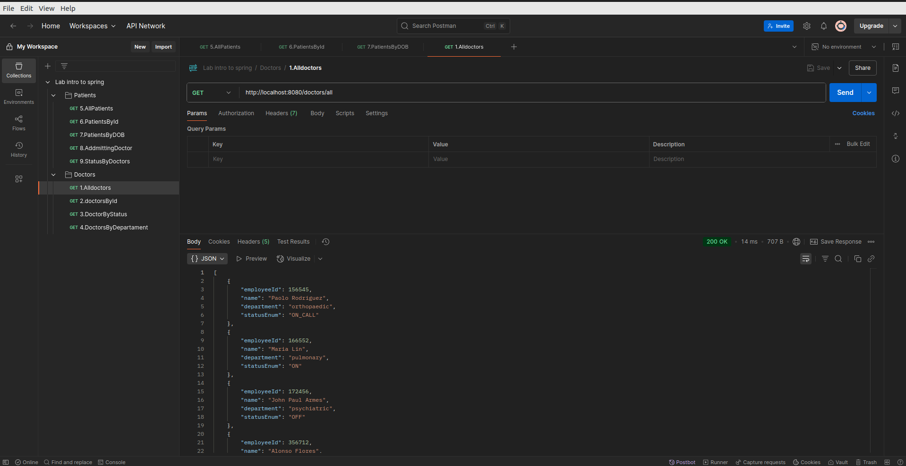
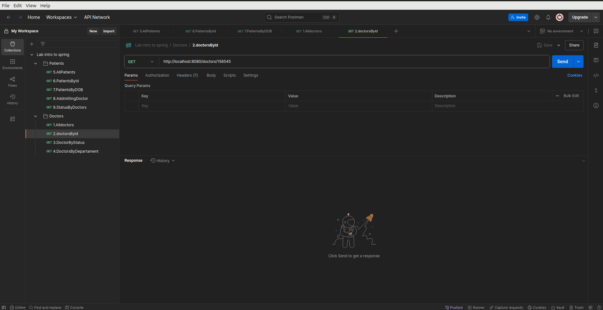
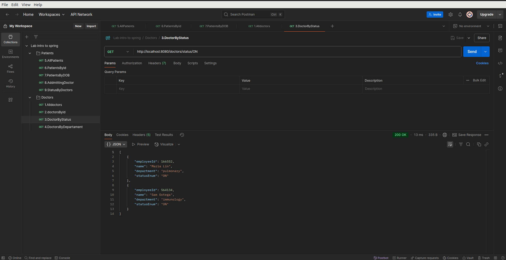
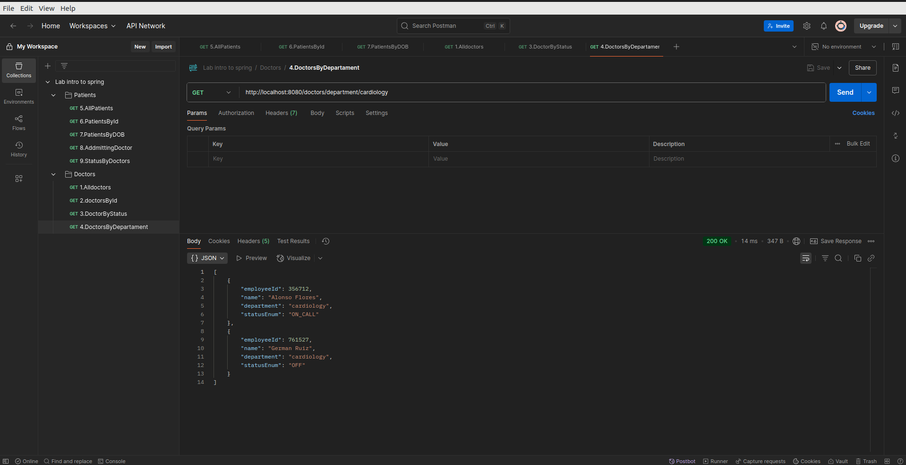

# Postman Collection for Doctor's API
Get all doctors: Create a route to get all doctors.

Get doctor by ID: Create a route to get a doctor by employee_id.

Get doctors by status: Create a route to get doctors by status.

Get doctors by department: Create a route to get doctors by department.

Get all patients: Create a route to get all patients.

Get patient by ID: Create a route to get a patient by patient_id.

Get patients by date of birth range: Create a route to get patients date of birth within a specified range.

Get patients by admitting doctor's department: Create a route to get patients by the department that their admitting doctor is in (For example, get all patients admitted by a doctor in cardiology).

Get all patients with a doctor whose status is OFF: Create a route to get all patients with a doctor whose status is OFF.

